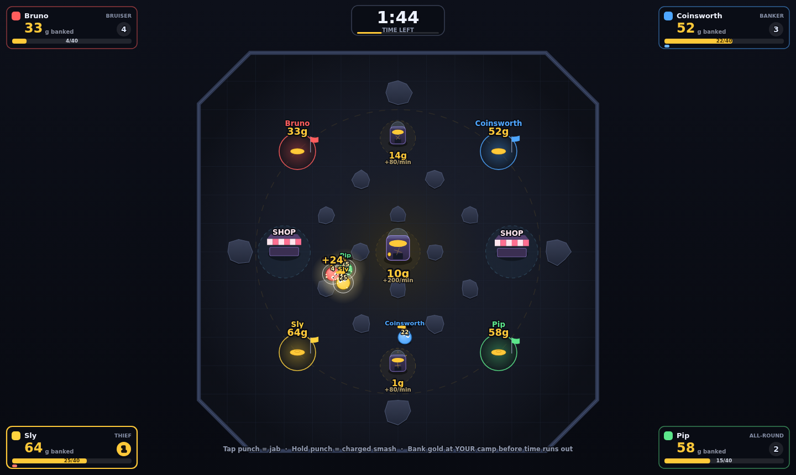
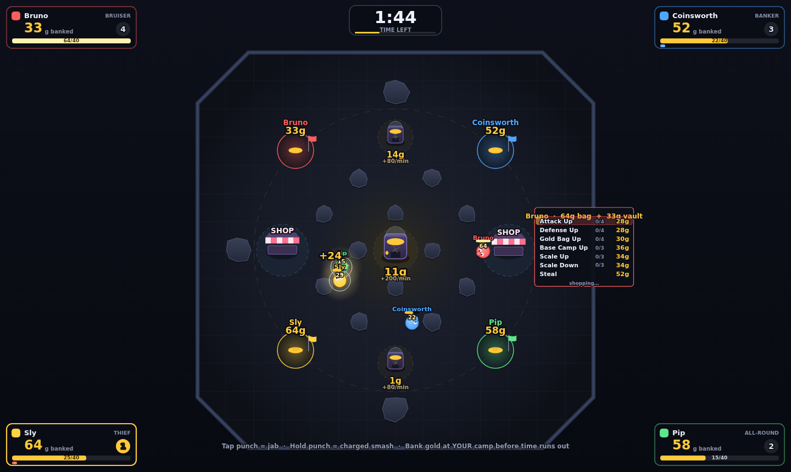

# GoldHunter

A 2½-minute, four-player gold rush brawler that runs in a single HTML file — no
install, no external assets.

Four prospectors spawn at base camps 25 m from a central coin popper. Mine it,
punch the gold out of each other, spend at the shops, and bank more than anyone
else before the whistle. **Only gold sitting in your base camp at the end
counts** — whatever is still in your bag is worth nothing.

Empty seats are filled by NPCs with distinct personalities that navigate,
fight, shop and raid on their own.



---

## Play it

```bash
open dist/goldhunter.html          # already built and committed
```

Or serve the source directly (ES modules need a server, not `file://`):

```bash
npm run dev                        # http://localhost:8080
```

## Controls

| Seat | Move | Punch | Dash |
| --- | --- | --- | --- |
| P1 | `W A S D` | `Space` | `Left Shift` |
| P2 | `I J K L` | `O` | `U` |
| P3 | Arrow keys | `/` | `.` |
| P4 | Numpad `8 4 5 6` | Numpad `0` | Numpad `.` |

Gamepads are picked up automatically and can be assigned to any seat in the
lobby (left stick / d-pad, **A** punch, **B** dash).

- **Tap punch** → fast jab. **Hold punch** → the fist charges (up to 1.15 s) and
  the release rips far more gold, knocks further, and freezes the frame harder.
- Inside a shop the buttons change: **dash cycles the selection**, **hold punch
  to buy**.

Match hotkeys: `Enter` start · `R` rematch · `Esc` lobby · `P` pause · `M` mute ·
`H` hints · `F2` draw the AI's paths.

---

## How a match plays

| | |
| --- | --- |
| Match length | 150 s (2½ min) after a 3-2-1 countdown |
| Base camps | 4, evenly spaced on the diagonals, 25 m from the centre |
| Motherlode (centre) | starts 50 g, generates **200 g/min**, holds 320 |
| Small poppers (×2) | start 20 g, generate **80 g/min**, hold 160 |
| Shops | 2, west and east |
| Bag | 40 g to start, upgradeable to 140 g |
| Gold Rush | last 25 s — poppers pump **2.5×** and the centre gets a 60 g dump |

The layout is rotationally fair: every player is the same distance from the
Motherlode, from one small popper and from one shop.

```
                small popper
    camp NW  ...................  camp NE
                [pillars]
    shop W   ...  MOTHERLODE  ...  shop E
                [pillars]
    camp SW  ...................  camp SE
                small popper
```

Rock pillars ring the centre and gate each camp's approach lane, so the
Motherlode is a contested chamber rather than an open field.

**Getting gold**

- Stand in a popper's ring to siphon it into your bag (34 g/s at the centre).
- Punching a popper shakes coins loose onto the floor — fast, but wasteful.
- Walk into your own camp to bank. Banked gold is safe from punches.
- Loose gold on the floor is magnetic and free for anyone.

**Taking gold**

- A jab rips **35 %** of the victim's bag; a full charge takes up to **80 %**.
  Attack and Defense upgrades scale that. 75 % goes straight to the attacker,
  the rest sprays across the floor for anyone to scoop.
- With the **Steal** upgrade you can punch an enemy *base camp* and take 25 % of
  their vault (max 70 g), with a 4.5 s cooldown per camp.

## The shop

Shops bill your **bag first, then your vault** — so an upgrade always costs you
final score. A price shown in amber means the vault has to chip in.

| Item | Cost | Max | Effect |
| --- | --- | --- | --- |
| Attack Up | 28 / 52 / 76 / 100 | 4 | +22 % gold ripped and knockback per level |
| Defense Up | 28 / 52 / 76 / 100 | 4 | −18 % gold lost per hit, resist knockback |
| Gold Bag Up | 30 / 56 / 82 / 108 | 4 | +25 carry capacity |
| Base Camp Up | 36 / 70 / 104 | 3 | −30 % vault theft, +35 % deposit speed, +4 % end bonus |
| Scale Up | 34 | 3 | Bigger: +22 % reach, +18 % power, −10 % speed |
| Scale Down | 34 | 3 | Smaller: +10 % speed, smaller target, weaker punch |
| Steal | 52 | 1 | Punch enemy base camps to rob their vaults |

Scale Up and Scale Down share one axis (−3 … +3), so buying one walks back the
other.



## The NPCs

Bots are not on rails. Every tick each one scores seven candidate goals — mine,
bank, hunt a carrier, shop, raid a vault, grab loose coins, run away — and
commits to the best, with hysteresis so they don't dither. Personality weights
skew those scores:

| Bot | Attack will | Bank will | Steal will | Plays like |
| --- | --- | --- | --- | --- |
| **Bruno** (Bruiser) | 90 % | 42 % | 45 % | Hunts carriers, buys Attack and Scale Up |
| **Coinsworth** (Banker) | 20 % | 92 % | 15 % | Farms and banks constantly, armours the vault |
| **Sly** (Thief) | 55 % | 45 % | 95 % | Rushes Steal, then raids vaults |
| **Pip** (All-round) | 55 % | 60 % | 50 % | Balanced |

Movement is real navigation, not steering into walls: static blockers are
rasterised into a grid, routes come from A\* with line-of-sight string pulling,
and local separation keeps bots from clumping. Press `F2` in a match to draw
their paths.

Difficulty (Easy / Normal / Hard) scales reaction time, aim jitter, charge
discipline and movement speed on top of the personality.

## Feel

- **Hit stop** freezes the simulation on every connect — 55 ms for a jab, up to
  190 ms for a full charge — while particles and camera keep running on real
  time, so impacts read as a snap rather than a dropped frame.
- **Coin poppers shake** continuously while being drained, jolt on every
  generation tick, and convulse when punched.
- Screen shake on a trauma model, zoom kick, white flash on heavy hits,
  squash-and-stretch, charge aura, floating damage numbers, coin sprays, and
  camp alarm rings when a vault is raided.
- All sound is synthesised at runtime with WebAudio — no audio files.

---

## Project layout

```
index.html            dev entry (loads src/ as ES modules)
styles.css            lobby / results styling
src/
  config.js           EVERY gameplay number lives here
  core/
    math.js           vectors, easing, seeded RNG, collision helpers
    input.js          keyboard + gamepad + virtual (AI) controllers
    audio.js          WebAudio synth SFX
    fx.js             particles, rings, floating text, shake, hit stop
  game/
    world.js          arena build, simulation step, combat, purchases, scoring
    entities.js       Player, CoinPopper, BaseCamp, Shop, Rock, GoldPickup
    npc.js            utility-scoring AI brain
    nav.js            nav grid, A*, string pulling, path following
    items.js          shop catalogue, pricing, purchase application
    render.js         canvas renderer
    hud.js            in-match HUD
  ui.js               lobby + results DOM screens
  main.js             screen flow, frame loop, hotkeys
tools/
  build.js            zero-dependency bundler -> dist/
  smoke.js            headless balance + regression harness
  input-test.js       real-keyboard human input test
  shots.js            screenshot generator
dist/
  goldhunter.html     standalone single-file build
  artifact.html       same page as a body fragment
```

## Build and test

```bash
npm run build      # bundle src/ -> dist/goldhunter.html + dist/artifact.html
npm test           # build, then 6 NPC matches + 12 real-keyboard input checks
npm run balance    # 12-match sweep with per-player detail
npm run shots      # regenerate docs/*.png
```

The bundler is ~150 lines of dependency-free Node: it walks the module graph
from `src/main.js`, wraps each module in a small registry so top-level names
can't collide, and inlines the CSS.

`tools/smoke.js` plays full NPC-vs-NPC matches in headless Chromium on an
accelerated clock and asserts that nothing throws, that bots navigate, mine,
bank, fight and shop, that at least one vault raid happens, and that nobody
finishes with an empty vault. It prints a balance summary, which is how the
numbers above were tuned:

```
GoldHunter balance — 12 matches · difficulty=normal
  winners            Banker:5  All-round:4  Bruiser:2  Thief:1
  scores             top 209g · median 156g · low 18g
  fighting           38 punches landed/match
  economy            11 upgrades bought/match · 380g spent
  AI goal share      mine 36%  bank 27%  hunt 22%  shop 12%  loot 2%
```

`tools/input-test.js` presses real keys in a real browser, because the bot
harness drives virtual controllers and would happily pass with keyboard
handling completely broken. It caught exactly that: a jab tapped and released
between two frames used to be dropped entirely.

## Tuning

Open `src/config.js` — match length, popper rates, bag size, punch numbers,
item prices and effects, NPC personalities and difficulty all live there, and
nothing else hard-codes a gameplay value. After a change, `npm test` tells you
within a minute whether the economy still works.

## Notable design decisions

- **Shops bill bag then vault.** Charging the bag alone was tried first: the bag
  is small, so it becomes a hard price ceiling, and expensive items can only be
  bought by loitering with a fat unbanked bag — exactly what rivals punch out of
  you. In testing that made Steal effectively unbuyable and let the passive
  Banker archetype win 10 of 12 matches. Vault funding keeps every upgrade
  reachable and makes the price honest, since it comes off your score.
- **Carrying is risk.** A full bag slows you by 12 % and is the only gold that
  can be punched loose, so the pressure to bank is constant.
- **The leader gets hunted.** Bots weight attacks and vault raids 1.3× against
  whoever is ahead, which stops a 2½-minute match from being decided at 0:40.
- **Bots keep a reserve.** They refuse to spend vault gold they can no longer
  earn back; without it they shopped themselves down to nothing.

## Licence

MIT.
